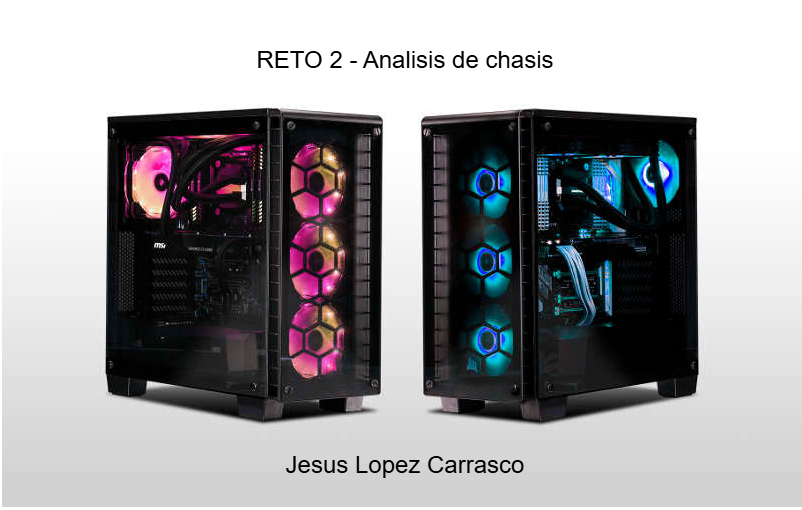
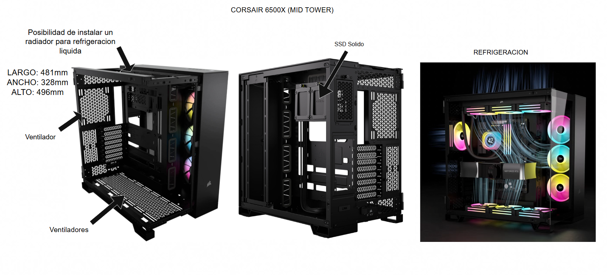

# Reto 02 — Análisis de Chasis (UT2 · RA1)

# Portada

**Alumno/a:** Lopez Carrasco, Jesus  
**Grupo:** 1 ASIR 
**Fecha:**  08/11/2025

# Índice

1. [Portada](00-portada.md)
2. [Introducción](02-introduccion.md)
3. [Tabla de materiales](10-tabla_materiales/tu_tabla_materiales.md)
4. [Formatos y diagrama](20-formatos_y_diagrama/tu_diagrama_y_analisis.md)
5. [Caso práctico](30-caso_practico/tu_resolucion_caso.md)
6. [Reflexión personal](40-reflexion_personal/tu_reflexion.md)
7. [Entrega y checklist](99-entrega_y_checklist.md)

# Introducción

El chasis del PC es fundamental para la estructura y la refrigeración del sistema. Este trabajo investiga dos aspectos críticos en su diseño. Primero, se analizan comparativamente los materiales de construcción (Acero, Aluminio, Plástico), destacando sus pros y contras. Segundo, se comparan los formatos de torre (Full Tower vs. Mini Tower), evaluando su capacidad de hardware y gestión térmica. El objetivo es guiar la elección de un chasis óptimo según las necesidades de rendimiento y espacio.

## 1) Tabla comparativa de materiales

| Material            | Ventajas (3–4)                               | Desventajas (2–3)                          | Aplicaciones comunes (ejemplos)                  |
|---------------------|-----------------------------------------------|--------------------------------------------|--------------------------------------------------|
|Acero SECC|- Alta resistencia y durabilidad - Buen blindaje EMI/RFI  - Excelente relación calidad-precio| - Pesado   - Conductividad termica moderada  |Cajas de PC de gama media-baja, servidores, componentes industriales |
|    Aluminio         |- Ligero   - Excelente disipacion de calor   - Estetica premium | - Mas caro que el acero   - Menor resistencia a abolladuras que el acero | Cajas de PC de gama alta, portatiles.|
|Plástico              |- Muy ligero  - Bajo costo  - Facilidad para moldear formas complejas |- Menor resistencia y durabilidad  - Poca disipacion de calor  - Acumulacion de polvo| Paneles frontales/laterales, componentes internos no estructurales, cajas de bajo costo|
|Vidrio templado| - Estetica moderna y elegante  - Permite mostrar componentes internos  - Resistente a arañazos|- Fragil  - Pesado   - Aumenta la temperatura interna| Paneles laterales de cajas de PC de gama alta, mesas de centro, puertas de ducha|
|Materiales compuestos| -Muy alta resistencia y ligereza  - Permite diseños innovadores  - Variedad de propiedades|- Muy caros  - Procesos de fabricaciones complejos|Cajas de PC personalizadas de ultragama alta, componentes militares/aeroespaciales, coches deportivos|

## 2) Formatos: diagrama y análisis

**Formatos elegidos:** Mid Tower VS Mini Tower

## Diagrama Mid Tower

## Diagrama Mini Tower

## Impacto del tamaño
- **Capacidad de componentes:**  
**Mid Tower**:Soporte para placas hasta E-ATX. Acepta múltiples GPUs largas (hasta 400 mm) y hasta 8 ranuras PCIe. Ideal para el máximo hardware.
**Mini Tower**: Limitado a placas Mini-ITX. Solo acepta una GPU estándar (hasta 330 mm) y solo 2 ranuras PCIe. Poco margen de expansión.

- **Refrigeración:** 
**Mid Tower**:Excepcional. Diseño de doble cámara, espacio para múltiples radiadores de 360mm (superior, lateral, inferior) y custom loops. Flujo de aire optimizado para alto rendimiento.
**Mini Tower**: Limitada. Máximo 3 ventiladores y radiador de 120mm (solo superior). Depende de un flujo de aire vertical básico. Adecuado para componentes de TDP moderado. 

- **Uso típico:**  
**Mid Tower**:Workstations de diseño/simulación, Gaming de gama alta, servidores caseros. Usuarios que priorizan el rendimiento, la baja temperatura y las futuras expansiones.
**Mini Tower**:PC de escritorio compacto, HTPC (Home Theater PC), o Gaming moderado con énfasis en la estética. Usuarios con espacio limitado.

## 3) Caso práctico

## 1) Formato recomendado
**Elección:**  Torre completa
**Justificación:** La torre completa al ser mas amplia ofrece el maximo espacio para conectar multiples HDD/SSD solidos asi tambien una placa base mas grande y tener los maximos slots M.2 de SSD. Tambien permite instalar varias GPU de gran tamaño al tener espacio de sobra. Al tener tanto espacio tienes espacio de sobra para isntalar unos radiadores grandes para la refrigeracion liquida. Tambien facilita el mantenimiento y futuras ampliaciones. 

## 2) Material recomendado
**Elección:** Aluminio
**Justificación:** El aluminio tiene una excelente disipacion termica, es ligero y tiene una mayor durabilidad. Tambien se le podrian poner los paneles de acero para proporcionar una robustez estructural para poder soportar el peso de multiples componentes. 

## 4) Reflexión personal

- **Ruido del sistema:** El chasis es fundamental para controlar la contaminación acústica. Los materiales aislantes, el grosor de los paneles y los sistemas antivibratorios determinan si el equipo será discreto o molesto. Un buen diseño acústico permite que el sistema pase desapercibido, mejorando la concentración y evitando fatiga en sesiones prolongadas.

- **Temperatura:** La gestión térmica define el rendimiento sostenido del equipo. Un flujo de aire optimizado, filtros de polvo accesibles y espacio para ventiladores grandes o radiadores aseguran que los componentes funcionen en su rango ideal. Esto se traduce en mayor longevidad de los componentes y menor ruido, ya que los ventiladores no necesitan girar a máxima velocidad.

- **Acceso a puertos:** La ubicación de los puertos USB, audio y controles frontales/superiores afecta directamente en la comodidad diaria. Un chasis bien diseñado anticipa las necesidades del usuario, permitiendo conexiones rápidas sin tener que acceder a la parte trasera. La organización interna para cableado y el acceso a componentes simplifica el mantenimiento y actualizaciones.

- **Estética:** Los materiales (aluminio, acero, cristal templado) y acabados definen no solo el aspecto sino también la durabilidad y disipación térmica. La iluminación RGB, cuando está bien implementada, personaliza el ambiente sin resultar intrusiva. Un diseño estético coherente hace que el equipo se integre armónicamente en su entorno de trabajo u ocio.
